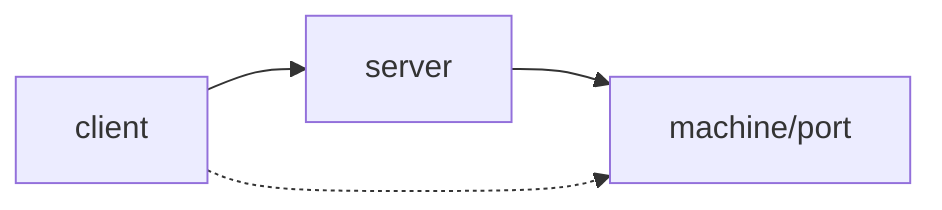
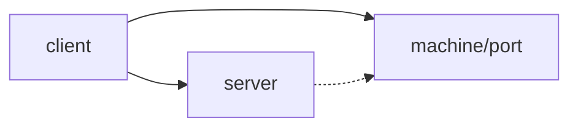

# 正向连接
正向连接是指client连上server, 然后把server能访问的机器地址和端口(包括server自己)镜像到client的端口上.


其中实线表示可以直接访问的机器地址或者端口, 虚线表示通过`正向连接`可以访问的机器地址或者端口.

命令格式:
``` shell
ssh -p server-SSH-PORT \
    -L client-IP:client-PORT:machine-IP:machine-PORT \
    user@server-IP
```
其中:
1. machine-IP和machine-PORT是server侧访问时使用的地址和端口.
2. client-IP可以省略, 默认为127.0.0.1.
3. server-IP可以用域名代替.

# 反向连接
反向连接是指client连上server, 然后把client能访问的机器地址和端口(包括client自己)镜像到server的端口上.


同样地, 实现表示可以直接访问的机器地址或者端口, 虚线表示通过`反向连接`可以访问的机器地址或者端口.

命令格式:
``` shell
ssh -p server-SSH-PORT \
    -R server-IP:server-PORT:machine-IP:machine-PORT \
    user@server-IP
```
其中:
1. machine-IP和machine-PORT是client端访问时使用的地址和端口.
2. server-IP可以省略, 默认为127.0.0.1, 那么只有server自身可以访问. 如果指定server-IP的话任何人都可以通过server-IP:server-PORT来访问服务, 同时如果server要访问这个服务的话也需要使用server-IP:server-PORT的格式.

参考:
1. [使用ssh正向连接、反向连接、做socks代理的方法_ssh 正向代理_linsanhua的博客-CSDN博客](https://blog.csdn.net/linsanhua/article/details/17360369)